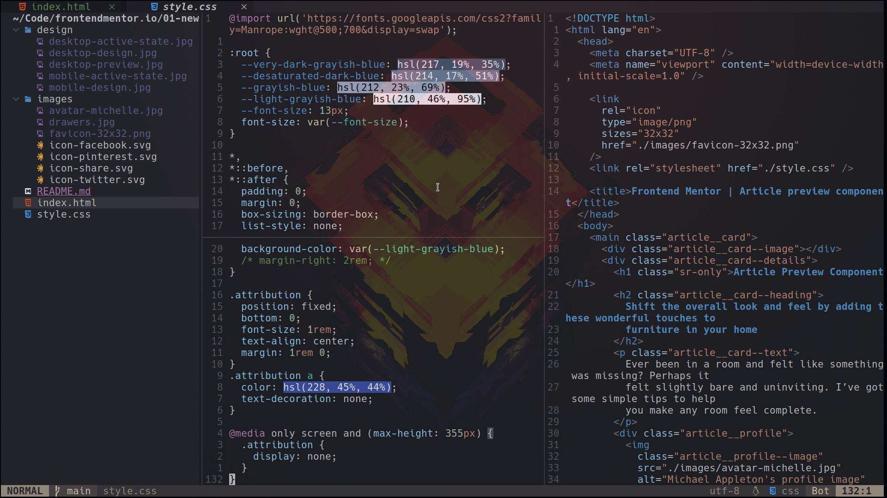
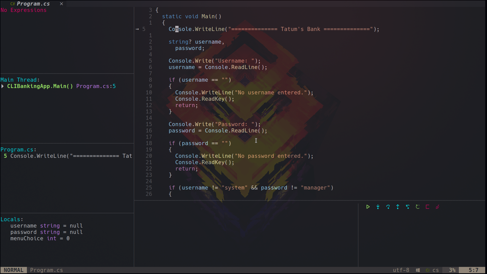
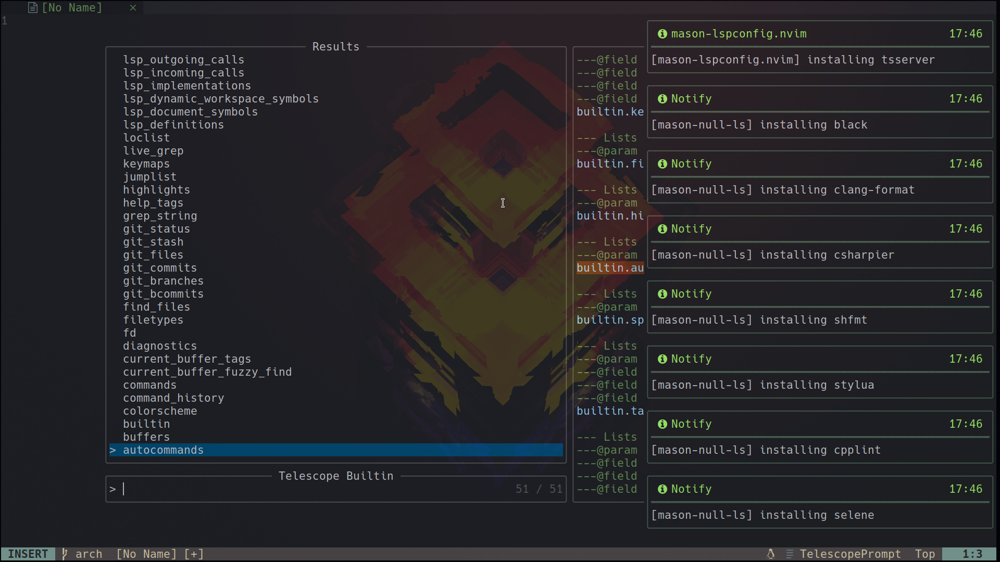

<h1 align='center'>NVIM v0.10.0-dev</h1>

Tatum's personal neovim text-editor customised to be a functional IDE for coding

<h2 align='center'>Setup</h2>

1. Clone this repo and place it to the `$XDG_CONFIG_HOME` location

* `cd $XDG_CONFIG_HOME`  
* `git clone git@github.com:tatumroaquin/nvim.git`

2. Delete the README document to prevent clutter

* `rm README.md`

3. Allow git to ignore the changes made to the README

* `git update-index --assume-unchanged README.md`

<h2 align='center'>Components</h2>

* [lazy.nvim](https://github.com/wbthomason/packer.nvim) - plugin manager
* [nvim-treesitter](https://github.com/nvim-treesitter/nvim-treesitter) - syntax highliter
* [nvim-cmp](https://github.com/hrsh7th/nvim-cmp) - completion engine / intellisense
* [nvim-tree](https://github.com/kyazdani42/nvim-tree.lua) - sidebar tree file explorer
* [telescope.nvim](https://github.com/nvim-telescope/telescope.nvim) - fuzzy file finder
* [null-ls.nvim](https://github.com/jose-elias-alvarez/null-ls.nvim) - code formatters, diagnostics, and code actions
* [mason](https://github.com/williamboman/mason.nvim) - centralised package neovim manager for LSPs, DAPs, and formatters
* [nvim-dap](https://github.com/mfussenegger/nvim-dap) - debug adapter protocol client implementation for neovim
* [nvim-dap-ui](https://github.com/rcarriga/nvim-dap-ui) - a UI for nvim-dap
* [nvim-lspconfig](https://github.com/neovim/nvim-lspconfig) - quickstart configs for nvim LSP
* [mason-lspconfig](https://github.com/williamboman/mason-lspconfig) - ease-of-use plugin that bridges nvim-lspconfig and mason.nvim
* [mason-nvim-dap](https://github.com/jay-babu/mason-nvim-dap.nvim) - allows for automatic installation of DAP debuggers
* [mason-null-ls](https://github.com/jay-babu/mason-null-ls.nvim) - allows for automatic installation of code formatters and linters
* [markdown-preview.nvim](https://github.com/iamcco/markdown-preview.nvim) - provides a live preview of markdown files
* [LuaSnip](https://github.com/L3MON4D3/LuaSnip) - snippet engine for neovim written in lua
* [friendly-snippets](https://github.com/rafamadriz/friendly-snippets) - set of preconfigured snippets for different programming languages
* [Emmet-vim](https://github.com/mattn/emmet-vim) - the infamous emmet plugin in vscode for rapid HTML coding

<!-- ### Completion -->
<!-- * [cmp-nvim-lsp](https://github.com/hrsh7th/cmp-nvim-lsp) -->
<!-- * [cmp-buffer](https://github.com/hrsh7th/cmp-buffer) -->
<!-- * [cmp-path](https://github.com/hrsh7th/cmp-path) -->
<!-- * [cmp-cmdline](https://github.com/hrsh7th/cmp-cmdline) -->
<!-- * [cmp_luasnip](https://github.com/saadparwaiz1/cmp_luasnip) -->

#### sources:
<https://github.com/LunarVim/Neovim-from-scratch>  
<https://github.com/LunarVim/nvim-basic-ide>  
<https://github.com/rockerBOO/awesome-neovim>  
<https://harrisoncramer.me/debugging-in-neovim>  
